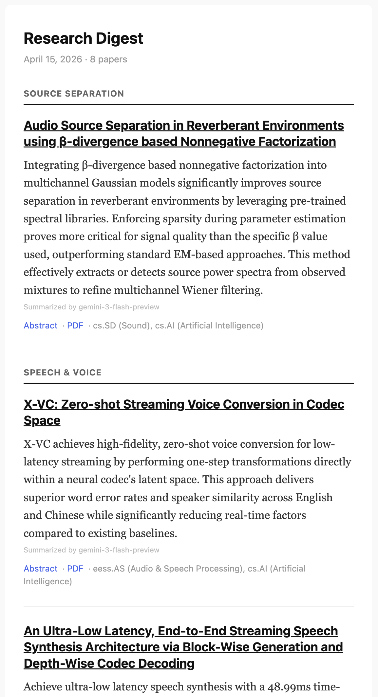

# Research Digest

A personal tool that generates a daily newsletter-style digest of relevant [arXiv](https://arxiv.org/) research papers, delivered straight to your inbox.

## Motivation

The idea for this tool was born out of the fact that I had to manually keep track of new research by searching, reading abstracts, etc. Some tools existed to help with this, but nothing tailored enough to my specific interests. Additionally, I subscribed to multiple different newsletters that present news and topics in a quick & digestible manner.

So the idea was to build a **simple & free** tool to provide me a similar blurb-style daily update of papers on relevant topics I am interested in. This would allow me to quickly glance through everything within a couple minutes each morning and dig deeper if something piques my interest.

I set it up to run both locally and with a [GitHub workflow](https://docs.github.com/en/actions/concepts/workflows-and-actions/workflows) for daily automation. It fetches recent papers, ranks them by relevance to the configured interests and groups by topic, summarizes each abstract with an LLM (within free-tier limits), then packages everything and sends a concise newsletter-style email.

While I initially built this just for my personal use, I realized that it could potentially be useful to others who find themselves in a similar boat as me. So I updated everything to make it easy to fork and adapt to any topics of interest. For example, I am particularly interested in audio and music AI/ML, so [my configuration](config/topics.yaml) only returns papers within this domain. But the tool itself is topic agnostic and can easily be updated to anything via the config file. I included a [generic template](config/topics.example.yaml) to get started quickly with any field. See **[step 2](#2-configure-your-interests)** in the instructions for more info.

## Example Digest & Highlights

<p align="center">
  
</p>

The `keyword_groups` in your [config](config/topics.example.yaml) control the topic sections you see in the digest (e.g., "Source Separation", "Speech & Voice" above). Papers are automatically sorted into the group whose keywords they match most strongly, and each paper only appears once.

**Highlights:**
- A weekday morning email with the most relevant papers in your field
- Concise, newsletter-style summaries via Google Gemini/Gemma (free tier, no billing setup required)
- Papers grouped by topic and ranked by relevance
- Resource links (Code, Model, Demo, Dataset, Colab) extracted automatically
- LaTeX math notation rendered as clean Unicode in emails (e.g., `$\beta$` becomes `β`)
- Works locally as a CLI with no API keys required (LLM and email are optional)

## Quickstart

### 1. Install

If you want to set up [automated daily emails](#6-automate-with-github-actions-optional), fork this repo first and then clone your fork. Otherwise, you can clone directly:

```bash
git clone https://github.com/<your-username>/research-digest.git
cd research-digest

# Create a virtual environment (pick one)
python3 -m venv .venv && source .venv/bin/activate  # standard venv
# OR: pyenv virtualenv 3.12 research-digest && pyenv local research-digest

pip install -e ".[dev]"
```

Requires Python 3.12+.

### 2. Configure your interests

```bash
cp config/topics.example.yaml config/topics.yaml
```

Edit [`config/topics.yaml`](config/topics.example.yaml) to match your field. Here's an example:

```yaml
sources:
  arxiv:
    # arXiv categories — find yours at https://arxiv.org/category_taxonomy
    categories:
      - cs.CV       # Computer Vision
      - cs.LG       # Machine Learning

    # Search phrases (AND-ed with categories)
    # Leave empty to get ALL papers in your categories
    keyword_queries:
      - "object detection"
      - "image segmentation"

# How papers are grouped in the digest email
keyword_groups:
  "Detection":
    - "object detection"
  "Segmentation":
    - "image segmentation"
```

### 3. Run locally

```bash
# Fetch, rank, and generate a Markdown digest
research-digest run

# Preview the arXiv query without fetching
research-digest fetch --dry-run

# Override lookback window
research-digest run --lookback-days 14

# Check database stats
research-digest status
```

Output is written to `output/<YYYY-MM-DD>/digest.md`. By default, each paper's summary is the first few sentences of its abstract — no API keys needed. For more concise, newsletter-style summaries, see the next step.

### 4. Add LLM summaries (optional, free)

To get concise, newsletter-style summaries instead of abstract excerpts:

1. Get a free API key at [Google AI Studio](https://aistudio.google.com/apikey) (no billing required)
2. Create `.env` from the template ([`env.example`](env.example)): `cp env.example .env`
3. Add your key: `GEMINI_API_KEY=your_key_here`
4. In `config/topics.yaml`, set:
   ```yaml
   summarization:
     mode: llm
     provider: gemini
   ```

The summarizer uses a 5-model fallback chain (Gemini 3 Flash → Gemini 3.1 Flash Lite → Gemma 4 → Gemini 2.5 Flash → Gemini 2.5 Flash Lite), ordered by benchmark quality. All models are within Google's free tier, and the chain automatically falls back to the next model if one has an outage or hits rate limits.

### 5. Add email delivery (optional)

To receive the digest as an email, you'll need a Gmail app password:

1. Create a [Gmail App Password](https://myaccount.google.com/apppasswords) (requires 2FA enabled on your Google account)
2. Add to your `.env`:
   ```
   EMAIL_FROM=you@gmail.com
   EMAIL_TO=you@gmail.com
   GMAIL_APP_PASSWORD=your_16_char_password
   ```
3. Run with email: `research-digest run --send-email`

### 6. Automate with GitHub Actions (optional)

I use GitHub Actions to get this delivered to my inbox every weekday morning automatically. The included [workflow](.github/workflows/digest.yml) handles everything — you just need to add your secrets:

1. Make sure you forked the repo (see [step 1](#1-install))
2. Go to your fork's Settings > Secrets and variables > Actions
3. Add these repository secrets:
   - `GEMINI_API_KEY` — your Google AI Studio key
   - `GMAIL_APP_PASSWORD` — your Gmail app password
   - `EMAIL_FROM` — sender email address
   - `EMAIL_TO` — recipient email address
4. That's it. The workflow runs at ~7 AM ET on weekdays.
   - Monday covers the weekend (3-day lookback)
   - Tuesday-Friday covers the previous day

You can also trigger manually from the Actions tab at any time.

**Note:** GitHub Actions scheduled runs can be delayed 10-60+ minutes during high load ([details](https://docs.github.com/en/actions/writing-workflows/choosing-when-your-workflow-runs/events-that-trigger-workflows#schedule)). I had a little trouble with this initially (GitHub can take a day or two before scheduled workflows start running reliably on a new fork), so give it at least a couple days.

## How it works

Here's what happens under the hood when the digest runs:

1. **Fetch** — queries the arXiv API with your configured categories + keywords
2. **Store** — persists paper metadata in local SQLite for deduplication
3. **Rank** — scores each paper: +10 per category match, +15 per keyword in title, +5 in abstract, +10 for recency
4. **Summarize** — extractive (first 3 sentences) or LLM-generated via Gemini (free tier)
5. **Render** — generates Markdown digest with topic grouping; LaTeX math converted to Unicode for email
6. **Deliver** — optional HTML email via Gmail SMTP

## Tests

```bash
pytest    # full test suite, all offline (no API keys or network needed)
```

CI runs on every push to main.

## Repository layout

```
src/research_digest/
  cli.py                — Typer CLI (run, fetch, send, status)
  config.py             — YAML + env var config loading
  models.py             — Pydantic data models
  fetchers/arxiv.py     — arXiv API client
  storage/              — SQLite persistence and deduplication
  pipeline/             — fetch, rank, summarize, build orchestration
  summarization/        — LLM provider abstraction (Gemini fallback chain)
  rendering/            — Markdown, HTML email, LaTeX-to-Unicode conversion
  delivery/             — email delivery (Gmail SMTP)
config/
  topics.example.yaml   — annotated template (generic ML/AI, easy to customize)
tests/                  — pytest test suite (all offline)
.github/workflows/      — GitHub Actions: daily digest + CI
```

## License

MIT License. See [LICENSE](LICENSE).
